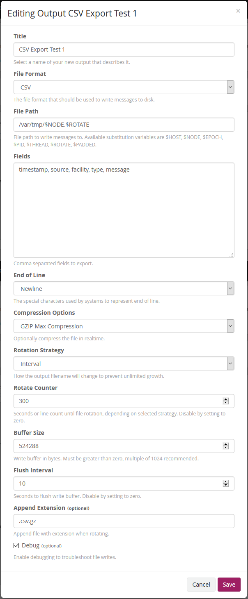

Graylog Delimited File Output
=============================

This plugin allows you to save messages from a Graylog 2.X server in various formats.  Messages are in delimited formats, including comma (csv), tab (tsv), pipe and space.  The files can be rotated based on line count or timed intervals.

This plugin supports Graylog 2.X+.

## How to build

This project is using Maven and requires Java 8 or higher.

You can build a plugin (JAR) with `mvn package`.

## How to use

  * Download graylog-delimited-file-output-plugin-<VERSION>.jar from releases and put inside plugins folder
  * Restart Graylog server
  * Create a new output globally or attached to a stream.

## Configuration

  * *File Format*: Select CSV, TSV, Pipe or Space
  * *File Path*: Full path on your server(s) that the graylog user has permission to write to
  * *Fields*: The fields you want to export
  * *End of Line*: Newline (\n) or CRLF (\r\n), the latter being more readable in Windows
  * *Compression Options*: None, GZIP, GZIP Fastest (1), GZIP Max Compression (9)
  * *Rotation Strategy*: Interval, Count
  * *Rotate Counter*: Seconds if Interval, Lines if Count
  * *Buffer Size*: Output buffer in bytes before flushing to disk
  * *Flush Interval*: Seconds before flushing the buffer regardless of how full it is
  * *Append Extension*: Optional string added when file is finished and rotated
  * *Debug*: Temporarily enable this to write extra information about saved messages, flushing, and rotation. If the Count rotation strategy is used, these entries will also be counted.



## File Formats

### CSV

Comma Separated Values, good for loading up into Excel.
Example:
````
"2017-06-01T07:43:07.481Z","host1099-99.testnetwork.local","filebeat","log","Jun  1 07:43:06 host1099-99.testnetwork.local sshd[26668]: Failed password for root from 123.183.209.136 port 37835 ssh2"
````

### TSV

Tab Separated Values, good for loading up into sql databases.  Empty values are replaced with \N.
Example:
````
2017-06-01T07:43:07.481Z	host1099-99.testnetwork.local	filebeat	log	Jun  1 07:43:06 host1099-99.testnetwork.local sshd[26668]: Failed password for root from 123.183.209.136 port 37835 ssh2
````

### Pipe

Fields are separated by the pipe "|" character.  Any pipe characters within the field value will be escaped.
Example:
````
2017-06-01T07:43:07.481Z|host1099-99.testnetwork.local|filebeat|log|Jun  1 07:43:06 host1099-99.testnetwork.local sshd[26668]: Failed password for root from 123.183.209.136 port 37835 ssh2
````

### Space

Fields are separated by a single space.  This is useful if you know the selected fields do not also contain spaces, or only the last field may contain spaces such as when recreating a raw syslog message.  Exporting a single field is also useful for generating lists.
Examples:
````
2017-06-01T07:43:07.481Z host1099-99.testnetwork.local filebeat log Jun  1 07:43:06 host1099-99.testnetwork.local sshd[26668]: Failed password for root from 123.183.209.136 port 37835 ssh2
````

## File Path Substitution

Use variables to dynamically generate the file path and name.  Currently supported are:
$HOST, $NODE, $EPOCH, $PID, $THREAD, $ROTATE, $PADDED.
  * *$HOST*: Local server's hostname
  * *$NODE*: Local graylog node's UUID
  * *$EPOCH*: Seconds since the start of the unix timestmap
  * *$PID*: Process ID of currently running graylog service
  * *$THREAD*: Thread ID of current worker that started the file handle
  * *$ROTATE*: Incrementing number, starts at 0 with a maximum of 999999
  * *$PADDED*: Same as $ROTATE, but padded with 6 zeros to maintain a natural sort of filenames

Note: When the plugin configuration is changed or graylog service is restarted, the plugin will attempt to start the $ROTATE and $PADDED sequence after the last saved sequence.  However if filenames with earlier sequences have since been removed, it will start there first.  For example, if export3, export4, and export5 exist, then it will create export0, export1, export2, then skip to export 6.

## Debug

When enabled, the Debug option will add extra information to the file being written.  Debug entries will be prefixed with "DEBUG:".

Examples:
````
DEBUG: Flushing buffer1 every 10 seconds, using pid 22120 thread 204 at 2017-06-01T07:44:33.664Z[Etc/UTC]
DEBUG: Writing csv with pid 22120 thread 145, trying fields [timestamp,source,facility,type,message] with fields available: [syslog_time,syslog_logdesc,gl2_remote_ip,gl2_remote_port,source,syslog_disklograte,loghost,type,gl2_source_input,syslog_mem,syslog_bandwidth,file,sourceip,syslog_type,syslog_level,host,r_isodate,gl2_source_node,syslog_devid,timestamp,syslog_cpu,s_isodate,offset,syslog_subtype,level,syslog_vd,input_type,syslog_setuprate,archive,message,syslog_action,syslog_disk,name,syslog_msg,_id,syslog_totalsession,syslog_fazlograte,syslog_devname,facility,syslog_logid]
DEBUG: Rotating file every 300 seconds, using pid 22120 thread 204 at 2017-06-01T07:44:43.646Z[Etc/UTC]
````
